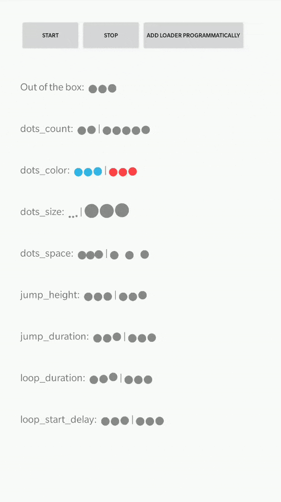

# Chat-Loading-Dots
This is kotlin base customizable bouncing dots view for smooth loading effect. Mostly used in chat bubbles to indicate the other person is typing.

## Features

 - LoadingDots animated view
 - Use in xml
 - Customize dots appearance
 - Customize animation behavior
 - Customize animation duration

## Import

#### In build.gradle (Project)

``` gradle
allprojects {
    repositories {
        ...
        maven { url "https://jitpack.io" }
    }
}
``` 

And then in the other gradle file(may be your app gradle or your own module library gradle, but never add in both of them to avoid conflict.)

``` gradle
dependencies {
	        implementation 'com.github.kapilmhr:Chat-Loading-Dots:Tag'
	}
```

## Demo




## Usage

For basic usage, simply add to layout xml:

 ```xml
    <app.frantic.loadingdots.LoadingDots
            android:layout_width="wrap_content"
            android:layout_height="wrap_content"/>
 ```

To customize, simply use the needed view attributes:

 ```xml
    <app.frantic.loadingdots.LoadingDots
            xmlns:app="http://schemas.android.com/apk/res-auto"
            android:layout_width="wrap_content"
            android:layout_height="wrap_content"

            app:LoadingDots_auto_play="true"

            app:LoadingDots_dots_color="@android:color/holo_blue_light"
            app:LoadingDots_dots_count="4"
            app:LoadingDots_dots_size="3dp"
            app:LoadingDots_dots_space="1dp"

            app:LoadingDots_loop_duration="800"
            app:LoadingDots_loop_start_delay="100"

            app:LoadingDots_jump_duration="200"
            app:LoadingDots_jump_height="4dp"/>
 ```
